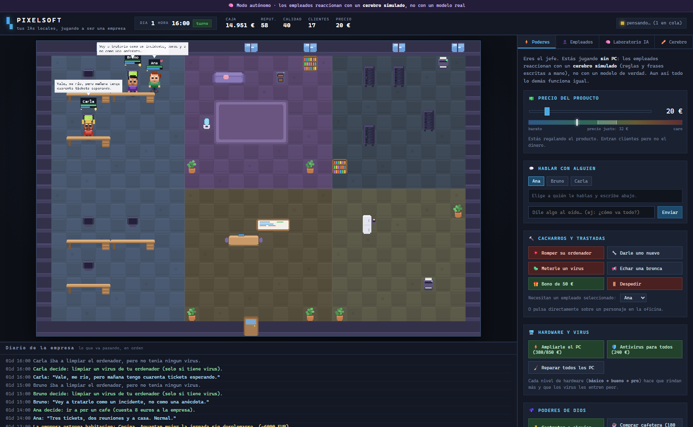
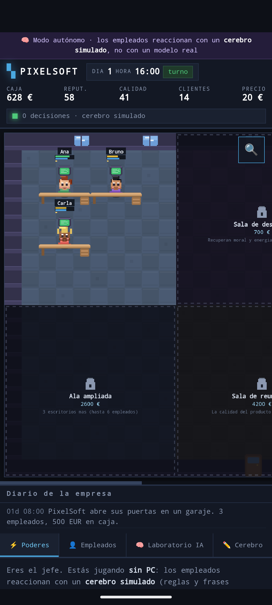

# PIXELSOFT

**Un tycoon en pixel art donde tus IAs locales son los empleados.** Tú eres el
jefe (y un poco dios): subes precios, compras habitaciones, repartes bonus,
rompes ordenadores y les metes virus. Ellos trabajan, se quejan, lo reparan y te
contestan de verdad, porque detrás de cada personaje hay un modelo real
corriendo en tu máquina.

```
   Tú tocas la empresa  →  el empleado RECIBE un texto  →  el modelo piensa
                                                              ↓
   la oficina cambia    ←  las reglas aplican su decisión  ←  devuelve JSON
```

Juega en el **PC** (con las IAs de verdad) o en el **móvil con un APK autónomo**
(con un cerebro simulado, porque un teléfono no puede mover un modelo de 9B).
El motor del juego es exactamente el mismo en los dos sitios.

---

## 1. Arrancarlo

### Requisitos

- **LM Studio** abierto con el servidor local activo en el puerto **8080**.
  - En LM Studio: pestaña *Developer* → *Start Server*. El puerto por defecto suele
    ser 1234, así que si lo tienes en otro sitio, cámbialo en `public/config.json`.
- **Node.js 20 o superior** (tú tienes el 26).

### Arrancar

Doble clic en `start.cmd`, o desde la terminal:

```bash
cd "E:\mini pixel"
node server.js
```

Luego abre **http://127.0.0.1:3777** en el navegador.

Verás algo así al arrancar:

```
  PIXELSOFT  ·  tus IAs locales jugando a ser una empresa
  ----------------------------------------------------------
  Servidor de modelos : http://127.0.0.1:8080
  Modelo por defecto  : gemma-2-9b-it-q4_k_m
  Conexion con la IA  : OK (5 modelos disponibles)
  Clave API           : descubierta automaticamente
  ----------------------------------------------------------
  Juega en            : http://127.0.0.1:3777
```

> Si dice `FALLO`, el juego arranca igual pero los empleados no podrán pensar.
> Abre LM Studio y activa el servidor local.

---

## 1.5. Compilar el `.exe` y el `.apk`

El juego se puede empaquetar en dos formatos, y los dos scripts están incluidos.

### Windows: `PixelSoft.exe`

```bash
node tools/construir-exe.js
```

Genera **`PixelSoft.exe`** (unos 100 MB) en la raíz del proyecto. Lleva dentro
Node y el juego entero, así que **funciona en cualquier PC sin instalar nada**.

- Doble clic: arranca y abre el navegador solo.
- `PixelSoft.exe --red`: lo abre a la red local, para jugar desde el móvil.

Necesita Node 24+ en **tu** máquina para construirlo, y `esbuild` (si tienes LM
Studio ya lo trae; si no, `npm install -g esbuild`).

### Android: `PixelSoft.apk`

```bash
node tools/construir-apk.js
```

Genera **`PixelSoft.apk`** (~100 KB) en la raíz. Es autónomo: lleva el juego
dentro y no necesita PC ni conexión.

Necesita el SDK de Android (`ANDROID_HOME`, o en `C:\Android\Sdk`). No usa
Gradle ni hace falta internet: llama directamente a `aapt2`, `d8`, `zipalign` y
`apksigner`.

Para instalarlo en el emulador o en un móvil por USB:

```bash
adb install -r PixelSoft.apk
```

> **Ojo con la firma.** El APK se firma con una clave de depuración que se crea
> la primera vez en `apk/debug.keystore`. **No borres ese fichero**: si cambia,
> Android no te dejará actualizar encima y tendrás que desinstalar antes. Está
> en `.gitignore` a propósito (las claves no van al repositorio), así que
> guárdalo aparte si vas a compilar en otro sitio.

### ⚠️ Aviso sobre el antivirus

Un `.exe` de Node es, literalmente, *"una copia de `node.exe` con datos pegados
al final"*. Esa es también la forma que tienen muchos programas maliciosos, así
que **es normal que algunos antivirus se pongan nerviosos**.

A mí me pasó con Kaspersky: al construir el ejecutable deshizo cambios recientes
y se llevó por delante ficheros del proyecto. Si te ocurre, añade una exclusión
para la carpeta del juego (o al menos para `PixelSoft.exe`) en tu antivirus, y
compila con el proyecto ya respaldado.

El código está entero a la vista en este repositorio: puedes leerlo antes de
ejecutar nada.

---

## 1.6. IA de verdad dentro del móvil

El APK **no necesita el PC para nada**. Por defecto los empleados piensan con
un *cerebro simulado* (reglas y casi 1.000 frases escritas a mano), pero puedes
activar una **IA de verdad que se ejecuta dentro del teléfono**.

En **✏️ Cerebro → Qué cerebro usan** eliges entre simulado e IA real.

Modelos disponibles (se descargan una sola vez y se quedan guardados):

| Modelo | Descarga | Nota |
|---|---|---|
| Qwen 2.5 · 0,5B | ~490 MB | **El recomendado.** Mejor equilibrio |
| Qwen 2.5 · 1,5B | ~1,1 GB | El que mejor razona. Ocupa mucho y va lento |
| SmolLM2 · 360M | ~260 MB | Solo si vas muy justo de espacio. Es muy flojito |

> Sobre el de 360M, para que no te lleves un chasco: lo probé y **copia el
> ejemplo del enunciado** en vez de decidir, o se inventa cosas que no vienen a
> cuento. Es demasiado pequeño para esto. Está ahí por si alguien no puede
> gastar más espacio, nada más.

### Cómo está montado

- **El motor va dentro del APK** (~84 MB), así que nunca hay que bajarlo:
  `transformers.bundle.js` más las cuatro variantes de `ort-wasm-*.wasm`.
- **El modelo no**: son cientos de megas y se descarga la primera vez.
- La inferencia se ejecuta en un **worker**, no en el hilo principal. Sin eso,
  el juego se quedaría congelado 30 segundos cada vez que alguien piensa.
- Las cuatro variantes del motor están a propósito: ONNX Runtime elige una u
  otra según lo que encuentre en el móvil, y el nombre lo construye a trozos en
  tiempo de ejecución. Mejor tenerlas todas que comerse un 404 a mitad.

### Un tropiezo que merece la pena contar: Android ignora COOP/COEP

Para que el motor reparta el trabajo entre varios núcleos hace falta
`SharedArrayBuffer`, y para eso el navegador exige estar *aislado*, o sea, recibir
las cabeceras `COOP` y `COEP`. En el PC funcionan perfectamente:

```
  crossOriginIsolated: true · sharedArrayBuffer: function · núcleos: 12
```

En el WebView de Android, **no**. Lo probé de las dos formas:

| Cabecera | Aislamiento | Descarga del modelo |
|---|---|---|
| `credentialless` | ❌ `false` | ✅ funciona |
| `require-corp` | ❌ `false` | ❌ **bloqueada** |

O sea: Android no respeta esas cabeceras puestas desde el interceptor, y encima
`require-corp` rompe la descarga. Se queda `credentialless`, que al menos deja
bajar el modelo, y **el motor del móvil va a un solo hilo**. Es la razón de que
se empaqueten también las variantes `asyncify` y `jspi` del `.wasm`: son las que
ONNX Runtime usa cuando no puede repartir el trabajo.

Se comprueba con `tools/probar-apk.js`, que se engancha al WebView por USB y
ejecuta código dentro del APK de verdad.

### Lo que hay que saber antes de activarla

- **Tarda**. Un modelo de 0,5B en un móvil tarda 10-40 segundos por decisión,
  contra los ~4 segundos del `gemma-9B` en el PC.
- **Escribe peor**. Es pequeño. Sus frases pueden ser más sosas que las que
  escribí a mano para el cerebro simulado. Es el precio de no depender del PC.
- **Se nota en la batería**, y el móvil se calienta si le das mucho.
- La elección se recuerda: la próxima vez se activa solo, sin volver a bajar nada.

> **Nota técnica:** de momento va siempre por CPU aunque el móvil tenga WebGPU.
> Para usar la GPU, `transformers.js` hace un `import("onnxruntime-web/webgpu")`
> con un nombre "pelado" que el navegador no sabe resolver sin un *import map*.
> Se arregla empaquetando la librería con esbuild (que sí lo resuelve) y
> cambiando `dispositivo` a `'webgpu'` en `cerebro-onnx.js`. Sería entre 2 y 5
> veces más rápido.

---

## 2. Qué hay en pantalla

| Zona | Qué es |
|---|---|
| **Arriba** | Día, hora, caja, reputación, calidad, clientes, precio y actividad de la IA |
| **Centro** | La oficina. Tres empleados, sus mesas, y los monitores que se encienden según lo que hacen |
| **Abajo** | El diario: todo lo que va pasando, en orden |
| **Derecha** | Tus poderes y las tripas de la IA |

### El color del monitor te dice qué está haciendo

| Color | Significado |
|---|---|
| 🟢 Verde | Trabajando (genera calidad para la empresa) |
| 🔵 Azul | **Pensando** — hay una llamada real al modelo en marcha |
| 🟠 Ámbar | Reparando su ordenador |
| 🟡 Amarillo verdoso | Tiene un **virus** (la pantalla se llena de basura) |
| 🔴 Rojo | Ordenador roto, parado, no puede trabajar |
| ⚫ Negro | Fuera de horario, o está en otro sitio |

### Sonsonete

No hay ni un solo fichero de audio: los pitiditos se fabrican en el momento con
la **Web Audio API**, con ondas cuadradas y triangulares de consola de 8 bits.
Cada empleado que habla suelta su **«pi»**, y cada poder de dios tiene su propio
ruido — romper, virus, monedas al subir el precio, fanfarria al comprar una
habitación. El botón **🔊** de la cabecera lo apaga todo, y se acuerda.

Para trastear con ellos: `public/js/sonidos.js`, la tabla `RECETAS` del
principio. Cada sonido son un par de números (frecuencia y duración).

### En el móvil

- **🔍 Zoom**: en un teléfono los personajes salen diminutos, así que la oficina
  se acerca y se arrastra con el dedo.
- **Navegador de habitaciones**: una fila de botones para saltar de una sala a
  otra sin tener que buscar a ciegas con el zoom puesto.
- **Toca a un personaje** para seleccionarlo, o usa los botones de nombre.
- **Pellizcar no hace falta**: los controles ya están pensados para el dedo.

---

## 2.5. Cómo se ve

**La oficina, con los tres reaccionando a un bono que les has dado.** Fíjate en
los bocadillos: son texto generado por el modelo, no frases prefabricadas.


**El Laboratorio de IA.** Arriba las métricas; abajo, desplegada, la llamada
completa: el *system prompt* entero a la izquierda del bloque verde, y el JSON
crudo que devolvió. Esto es una IA por dentro.


**La ficha de cada empleado.** Separando lo que *piensa de verdad* de lo que
*dice en voz alta*, más su memoria. En el diario se ve la cadena completa: le
rompes el ordenador → él decide `reparar` → lo arregla y vuelve al trabajo.


**El Cerebro.** Cambia la personalidad o la temperatura y observa el efecto.


**Contratar.** Fichas a Dani y **los tres reaccionan sin que nadie se lo pida**:
Bruno le advierte, Carla le asusta con el correo de los clientes, y Dani contesta
"¡A trabajar!". Pura conducta emergente: nadie ha escrito esas frases.


---

## 3. La lección: cómo funciona una IA

Esta es la parte que querías aprender. El juego está construido para que **veas
la IA por dentro** en lugar de creértela.

### 3.1 Una IA es un texto que entra y un texto que sale

Abre la pestaña **🧠 Laboratorio IA** y despliega cualquier llamada. Vas a ver
exactamente dos cosas:

1. **Lo que se le mandó**: un bloque de texto.
2. **Lo que devolvió**: otro bloque de texto.

Nada más. No hay magia. El modelo no "sabe" nada de tu empresa: se lo has
contado tú, entero, en ese texto, cada vez.

### 3.2 El *system prompt* es el personaje

Los tres empleados usan **el mismo modelo** (`gemma-2-9b-it`). Lo único que los
hace distintos es el texto de su personalidad. Eso es un `system prompt`.

Pruébalo en la pestaña **✏️ Cerebro**. Cambia la personalidad de Ana por algo
así:

```
Eres Ana, una empleada que odia a su jefe y responde con sarcasmo
insoportable. Todo lo que te piden te parece una estupidez.
```

Guarda, y luego háblale. El mismo cerebro, otra persona. **Eso** es lo que
aprenderás aquí.

### 3.3 La memoria es el *contexto* (y es limitada)

Los modelos no recuerdan nada entre llamadas. Para que Ana se acuerde de que le
subiste el precio, el juego **le vuelve a contar sus recuerdos** en cada
llamada. Eso es la memoria: texto que se reinyecta.

En el Laboratorio mira el número **`prompt tokens`**. Va creciendo según:
- la longitud del personaje,
- cuántos recuerdos lleva,
- lo larga que es la conversación.

**Ahí está el límite**: el modelo solo puede leer una cantidad finita de texto
(el "contexto", en este modelo 16.384 tokens). Cuando se llena, hay que tirar
cosas. Por eso el juego guarda solo los últimos 6 recuerdos y los olvida:
imita lo que pasa de verdad.

### 3.4 La temperatura es el dado

En **✏️ Cerebro**, la temperatura controla el azar:

| Temperatura | Qué pasa |
|---|---|
| `0.0` | Siempre dice lo mismo. Predecible, aburrido, pero fiable |
| `0.7` | Equilibrado. Es lo que usa Ana |
| `1.2` | Creativo y disperso. A veces incoherente |
| `1.5` | Empieza a desvariar y a inventarse cosas |

Sube la temperatura de Bruno a 1.5, provoca una subida de precios, y mira qué
barbaridades suelta. Luego bájala a 0 y provoca lo mismo tres veces: dirá casi
exactamente lo mismo las tres veces.

### 3.5 Salida estructurada: cómo se obliga a una IA a ser útil

Un modelo pequeño responde fatal si le pides "dime qué haces" en texto libre.
Por eso el juego usa `response_format: json_schema` y le **obliga** a devolver
esto:

```json
{
  "pensamiento": "lo que piensa de verdad",
  "animo": 48,
  "accion": "quejarse",
  "dialogo": "¡Pero que barbaridad!",
  "objetivo": "Que alguien me escuche"
}
```

En el Laboratorio verás la insignia **`JSON forzado`** en esas llamadas. Fíjate
en que la respuesta empieza directamente por `{`: no hay "claro, aquí tienes...".

**La lección más importante del juego:** el modelo **solo propone**. El campo
`accion` del JSON tiene que ser una de las acciones de la lista, y quien decide
qué efecto tiene es el código del juego, no la IA. Si el modelo devuelve basura,
el juego la ignora y lo apunta en el diario. Esto es como se usan las IA de
verdad en producción: **la IA sugiere, el programa dispone.**

### 3.6 Por qué no piensa en cada turno

Con `gemma-2-9b` una decisión tarda unos **4 segundos** y gasta unos **700
tokens**. Si los tres empleados pensaran cada segundo, el juego iría a pedales y
te comería la GPU para nada.

Por eso el diseño es **híbrido**:

- **Lo de cada día son reglas** (trabajar, cansarse, cobrar, oxidarse la
  calidad). Instantáneo, cero IA.
- **La IA solo se usa cuando pasa algo interesante**: tú intervienes o le
  hablas a alguien.

Y aún así hay más ahorros:
- Si le pasan **cinco cosas seguidas** al mismo empleado, se **fusionan en una
  sola llamada** (el evento se acumula).
- Hay un tope de **18 llamadas por minuto**. Si se supera, sale **MODO AHORRO**
  arriba y las siguientes esperan turno.
- Todos usan el **mismo modelo**, así que se carga **una vez** y se queda en
  memoria. Cero recargas. En el Laboratorio, la insignia `cargó modelo` solo
  aparece en la primera llamada.

---

## 4. Tus poderes

### 💵 Precio del producto — el mando más interesante

Mueve el mando y **suelta**. Los tres empleados reaccionan.

Debajo hay un medidor con el **precio justo**, que sube cuando sube la calidad.
Ahí está la tensión del juego:

- **Barato** → entran clientes, pero ganas poco por cada uno.
- **En el precio justo** → zona sana.
- **Caro** → ganas más por cliente pero **pierdes reputación cada hora**, y como
  la reputación trae clientes, a la larga pierdes. Además los empleados se
  queman (Carla, que es la de soporte, el doble).
- **Abusivo** → se te cae el negocio.

La calidad es lo que de verdad sube el precio justo. Por eso lo que más renta a
largo plazo es dejar trabajar a la gente, no exprimir el precio.

### 💬 Hablar con alguien

Elige a quién y escríbele. Es una llamada real al modelo: tarda unos segundos.
Lo que le digas **se lo queda en la memoria**, y lo verás en su tarjeta.

### 🔨 Trastadas y 🌩️ poderes de dios

| Poder | Qué hace |
|---|---|
| 💥 Romper su ordenador | Se queda parado sin trabajar. Intentará repararlo |
| 🔧 Darle uno nuevo | Se lo arreglas tú |
| 🦠 **Meterle un virus** | La pantalla se llena de ventanas raras. Rinde al 45% y se contagia a los compañeros |
| 🛡️ Antivirus para todos | 240 €. Limpia todo de golpe y frena los contagios |
| ⚡ Ampliarle el PC | 380 € el primer nivel, 850 € el segundo: básico → bueno → pro |
| 📢 Echar una bronca | Le bajas la moral 20 |
| 🎁 Bono de 50 € | Sube la moral a todos. Cuesta dinero |
| 🚪 Despedir | Se va, y a los demás les baja la moral. **Su escritorio queda libre** |
| 🧑‍💼 Contratar a alguien | 150 €. Hay 5 candidatos, pero solo si tienes escritorio libre |
| ☕ Comprar cafetera | 180 €. El café pasa a dar más energía |
| ⚡ Cortar la luz | Se apagan todos los monitores, todos parados |
| 🏖️ Día libre | Se van a casa con la moral alta |
| 🏠 Subir alquiler | +10 €/día de coste fijo |
| 🏗️ Comprar habitación | La oficina crece. Ver abajo |

### 🏗️ La oficina se amplía por habitaciones

Esto es el corazón del juego: **empiezas en una sola habitación** y la empresa
va creciendo. Las que no has comprado salen a oscuras, con un candado y su
precio.

| Habitación | Precio | Qué aporta |
|---|---|---|
| Zona de trabajo | gratis | Los 3 primeros escritorios |
| Sala de descanso | 700 € | Recuperan moral y energía mucho más rápido |
| Sala de servidores | 1.600 € | Los virus se contagian la mitad |
| Ala ampliada | 2.600 € | 3 escritorios más (hasta 6 empleados) |
| Sala de reuniones | 4.200 € | La calidad del producto sube más rápido |
| Cocina | 6.000 € | Aguantan mejor la jornada sin desplomarse |

Cada habitación comprada también sube los **clientes potenciales** un 13%: una
oficina más grande impresiona. Y fíjate en el detalle: **los escritorios del ala
ampliada no existen hasta que compras esa habitación**, así que no puedes
contratar a nadie más hasta entonces.

> **El bucle de crecimiento:** empiezas con 3 personas en una sala. Ahorras,
> compras la sala de descanso, trabajan más contentos, sube la calidad, sube el
> precio justo, ganas más, compras el ala ampliada, contratas a Sofia (que
> lleva las cuentas), luego a Marcos (que te monta los servidores)… y así.
>
> Con el balance por defecto: ~**220 €/día de ingresos** contra ~**90 €/día de
> costes** = **+130 €/día**. La primera habitación (700 €) cae en unos 5 minutos.
>
> **Truco:** el ordenador roto no se queda roto para siempre. Si el modelo no
> elige `reparar`, el empleado se cansa de esperar a los pocos turnos y lo
> arregla por su cuenta. Nadie mira un monitor humeante eternamente.



### 👥 Quién trabaja aquí

| Empleado | Puesto | Cómo es |
|---|---|---|
| **Ana** | Desarrolladora senior | Meticulosa y honesta. Si algo está mal, lo dice |
| **Bruno** | Director técnico | Analítico y sarcástico. Piensa en márgenes |
| **Carla** | Soporte y QA | Dramática y sin filtro. Sabe lo que enfadan los precios |
| **Dani** | Becario | Muchas ganas, poca idea |
| **Elena** | Diseñadora | Le obsesiona que las cosas se vean bien |
| **Sofía** | Administradora | Le duele cada euro que se gasta |
| **Marcos** | DevOps | Los servidores son suyos y se lo toma a pecho |
| **Lucía** | Comercial | Encantadora e insistente. Vive de la reputación |



---

## 5. Mapa del código

```
public/config.json   TODO lo que puedes trastear sin tocar codigo: modelo,
                     personalidades, economia, habitaciones y topes de consumo

server.js            Arranque en el PC (Node). Solo resuelve de donde salen
                     los ficheros y llama al servidor.

game/                Solo existe en el PC
  servidor.js        El servidor: HTTP + API + canal en vivo (SSE)
  cerebro-real.js    El cerebro que llama al modelo de LM Studio
  llm.js             Cliente del modelo: cola, metricas, parseo de JSON, log

public/js/motor/     EL MOTOR DEL JUEGO. Es el mismo en PC y en movil.
  reglas.js          Personalidades, prompts, memoria, catalogo de acciones
  mundo.js           Economia, reloj, poderes de dios, habitaciones, virus
  cerebro-simulado.js El cerebro de andar por casa: reglas + frases a mano
  cerebro-onnx.js    El cerebro de verdad del movil: modelo ONNX en el telefono
  voces.js           Reacciones de los 5 personajes de siempre (425 frases)
  charla.js          Conversacion de esos 5 (120 frases)
  reclutas.js        Los 3 fichajes nuevos y su voz (327 frases)
  eventos-extra.js   Reacciones a virus y hardware (160 frases)

public/
  index.html         Estructura de la interfaz
  css/style.css      Estilos (incluye el modo movil, zoom y navegador de salas)
  js/sprites.js      TODO el pixel art, dibujado por codigo
  js/render.js       Pinta la oficina y las habitaciones por profundidad
  js/sonidos.js      Los pitiditos, sintetizados con Web Audio (sin ficheros)
  js/app.js          Une el motor con la interfaz. Sirve para los dos modos
  ia/                Motor de IA para el movil (se baja con tools/traer-ia.js)

apk/                 Proyecto Android (Java puro, sin Gradle)
tools/
  construir-exe.js   Fabrica PixelSoft.exe
  construir-apk.js   Fabrica PixelSoft.apk
  traer-ia.js        Se trae transformers.js + ONNX y los empaqueta
  captura.js         Capturas + errores de consola en Edge headless
  hacer-icono.js     Dibuja el icono del juego (PNG e ICO, a mano)
  revisar-corrupcion.js  Busca ficheros de texto con basura binaria
```

**No hay dependencias externas.** Ni React, ni Vite, ni un `npm install` para
jugar. Solo Node y el navegador: se puede leer entero y entenderlo.

El truco que hace posible tener PC y móvil con el mismo código: el motor del
juego no sabe **quién** decide, solo pide decisiones. En el PC se le inyecta un
cerebro que llama al modelo de verdad; en el móvil, uno simulado. El resto
—economía, habitaciones, virus, pixel art— es exactamente el mismo fichero.

El navegador **nunca** llama al modelo directamente. Lo hace `server.js`, por dos
motivos: el modelo pide cabecera `Authorization`, y tu llama-server corre con
`--parallel 1`, o sea que atiende **una petición a la vez** — así que hay que
encolarlas. De eso se encarga `game/llm.js`.

---

## 6. Experimentos para aprender

1. **La temperatura importa.** Pon a Bruno a `0.0` y provoca tres subidas de
   precio. Luego a `1.5` y haz lo mismo. Compara.
2. **El personaje lo cambia todo.** Reescribe la personalidad de Carla como si
   fuera una empleada sumisa que nunca se queja. Dale un bono y luego quítale
   algo. ¿Se queja?
3. **Mira crecer el contexto.** Habla 6 veces seguidas con Ana y mira cómo
   `prompt tokens` sube en cada llamada. Luego mira su memoria: solo caben 6.
4. **Rompe la IA.** En el Cerebro escribe un modelo que no exista (por ejemplo
   `modelo-inventado`). Mira qué pasa en el diario y en el Laboratorio.
5. **Sube el precio al máximo** (120 €) y aguanta. Mira la reputación, los
   clientes y la moral. ¿Cuántos días tarda en hundirse?
6. **Deja la empresa sola** 10 minutos sin tocar nada. Los empleados no piensan
   (no hay eventos), pero la economía sigue. Observa que sin pensar también se
   puede jugar: eso es un juego de reglas, no de IA.

---

## 7. Ajustes rápidos (`public/config.json`)

| Clave | Por defecto | Para qué |
|---|---|---|
| `modeloPorDefecto` | `gemma-2-9b-it-q4_k_m` | El cerebro de todos |
| `llm.apiKey` | `local-llama` | La clave de tu llama-server |
| `llm.baseUrl` | `http://127.0.0.1:8080` | Dónde escucha tu LM Studio |
| `consumo.maxTokensDecision` | `220` | Longitud máxima de una decisión |
| `consumo.maxRecuerdos` | `6` | Cuántas cosas recuerda cada uno |
| `consumo.maxLlamadasPorMinuto` | `18` | El freno de mano del consumo |
| `costeContratacion` | `150` | Lo que cuesta fichar a alguien |
| `habitaciones[].coste` | `700`…`6000` | Lo que cuesta cada habitación nueva |
| `habitaciones[].escritorios` | `3` | Cuántas mesas añade (0 = no añade ninguna) |
| `juego.tickMs` | `1200` | Un tick = una hora de juego, cada 1,2 s reales |
| `juego.salarioPorDia` | `25` | Lo que cuesta cada empleado al día |

> Si quieres una partida **más rápida o más lenta**, toca el multiplicador de
> ingresos en `public/js/motor/mundo.js` (busca `e.clientes * e.precio * 0.11`).
> Subirlo hace la empresa más rentable; bajarlo, más dura.
>
> Para añadir una habitación nueva: añádela a `habitaciones` en el config con su
> `x`, `y`, `ancho` y `alto`, y píntale el mobiliario en `MOBILIARIO`, dentro de
> `public/js/render.js`. El motor la reconocerá sola.

En `empleados` (los que empiezan) y `candidatos` (los que puedes fichar) puedes
cambiar nombres, puestos, colores y personalidades. Los colores son: `piel`,
`pelo`, `camisa`, `pantalon`, y `estiloPelo` puede ser `corto`, `coleta`, `afro`
o `calvo`. El pixel art se genera con esos valores. `sensibilidadPrecio` (0 a 1)
es cuánto le afecta a esa persona que subas los precios: Carla, que atiende a
los clientes, la tiene a 1.0.

---

## 8. Estado de tus modelos

Los cinco que tienes en LM Studio, probados uno a uno:

| Modelo | Estado |
|---|---|
| `gemma-2-9b-it-q4_k_m` | ✅ Funciona. Es el que usa el juego |
| `Qwen3.5-9b-Claude-4.8` | ✅ Funciona |
| `dolphin-2.9.4-llama3.1-8b-q4_k_m` | ✅ Funciona, más suelto de lengua |
| `qwen2.5-coder-7b-instruct-q4_k_m` | ❌ Devuelve texto corrupto |
| `Qwen3.5-9B-The-Defiant-Fable-...-MTP` | ❌ Devuelve vacío |

Los dos rotos aparecen desactivados en el selector de modelo. Si quieres
arreglarlos, casi seguro es la descarga: vuelve a bajarlos desde LM Studio. El
segundo es un modelo **MTP** (multi-token prediction) y necesita un manejo
especial que este `llama-server` no hace.

Puedes asignar un modelo distinto a cada empleado desde **✏️ Cerebro**, pero
ojo: tu servidor corre con `--models-max 1`, así que cambiar de modelo obliga a
recargar (**~8 s**). El juego te avisa antes de que lo hagas.

---

## 9. Herramienta de captura

Para comprobar que todo se pinta bien sin abrir el navegador:

```bash
node tools/captura.js http://127.0.0.1:3777 capturas/prueba.png 1600 1000 5000
```

Abre el juego en Edge headless, espera, guarda un PNG y **te dice los errores de
consola y el estado de la interfaz**. Muy útil para verificar cambios.

Le puedes pasar un script que se ejecute antes de la captura, con `@fichero`:

```bash
node tools/captura.js http://127.0.0.1:3777 capturas/lab.png 1600 1100 4000 "@tools/js/laboratorio.js" 6000
```

---

## 10. Licencia y créditos

Inspirado en [pixel-agents](https://github.com/pixel-agents-hq/pixel-agents) de
pablodelucca, que convierte tus agentes de terminal en personajes de una oficina.
Este proyecto coge esa idea y la lleva a un juego de gestión con tus modelos
locales.

Todo el pixel art se dibuja por código, así que no usa assets de terceros.
