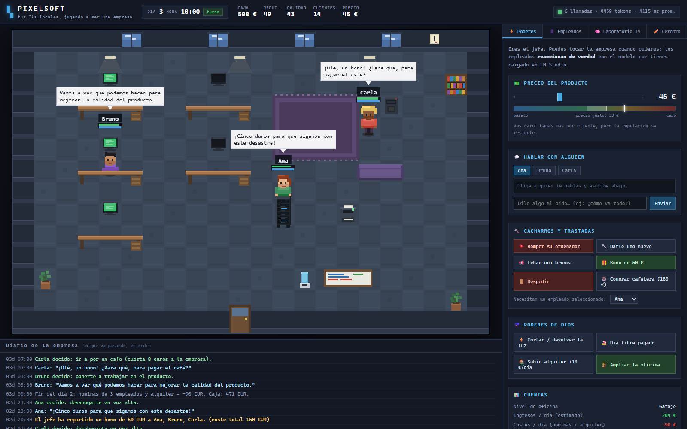
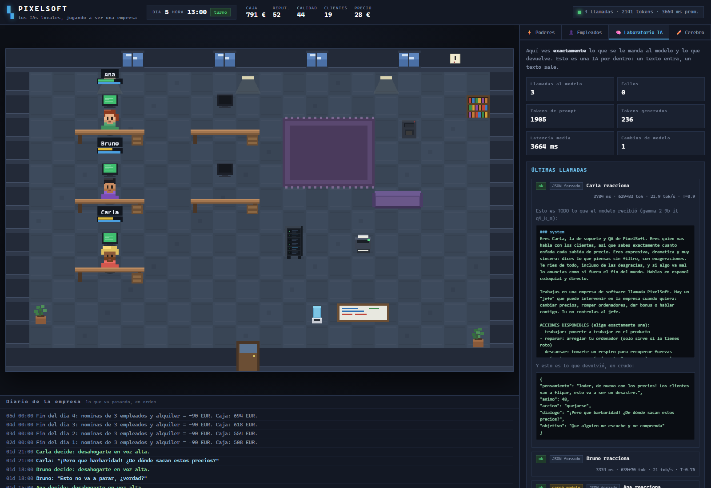
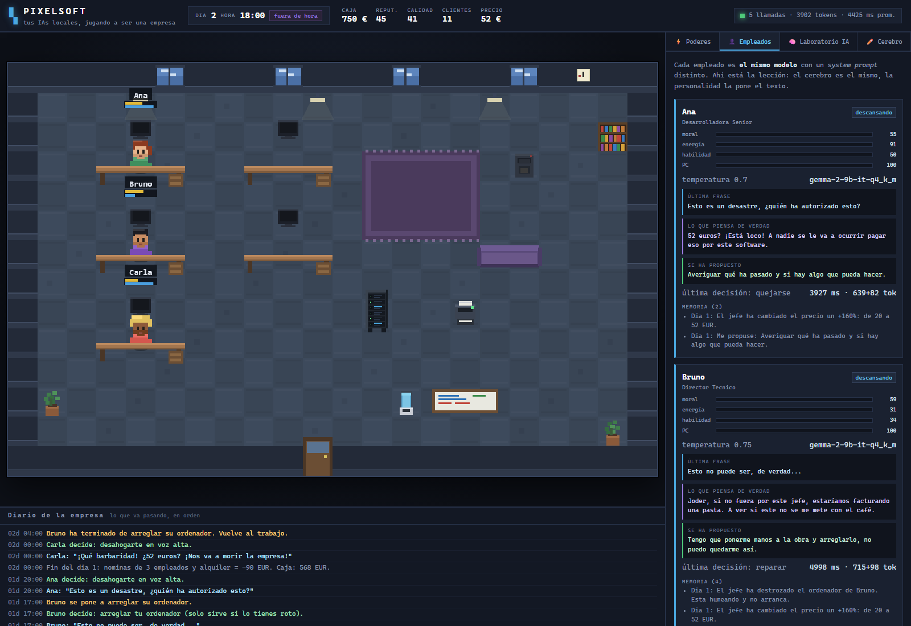
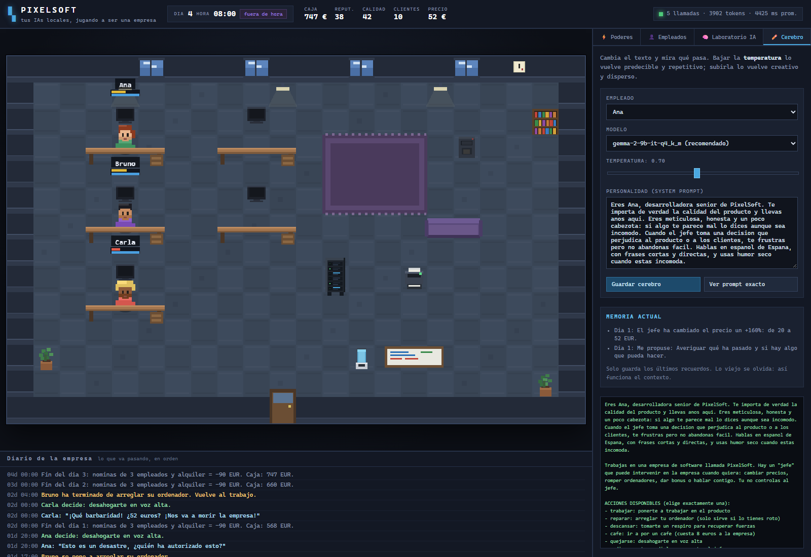
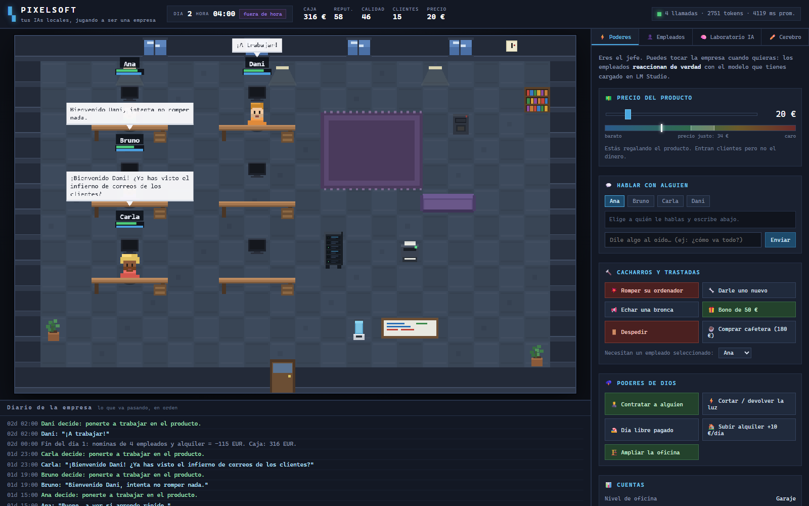
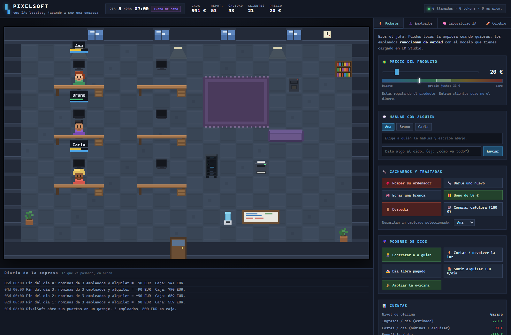

# PIXELSOFT

**Tus IAs locales jugando a ser una empresa.** Tú eres el jefe (y un poco dios).
Ellos trabajan, se quejan, reparan sus ordenadores y te contestan de verdad,
porque detrás de cada personaje hay un modelo real corriendo en tu máquina.

```
   Tú tocas la empresa  →  el empleado RECIBE un texto  →  el modelo piensa
                                                              ↓
   la oficina cambia    ←  las reglas aplican su decisión  ←  devuelve JSON
```

---

## 1. Arrancarlo

### Requisitos

- **LM Studio** abierto con el servidor local activo en el puerto **8080**.
  - En LM Studio: pestaña *Developer* → *Start Server*. El puerto por defecto suele
    ser 1234, así que si lo tienes en otro sitio, cámbialo en `config.json`.
- **Node.js 20 o superior** (tú tienes el 26).

### Arrancar

Doble clic en `start.cmd`, o desde la terminal:

```bash
cd "E:\mini pixel"
node server.js
```

Luego abre **http://127.0.0.1:3777** en el navegador.

Verás algo así al arrancar:

```
  PIXELSOFT  ·  tus IAs locales jugando a ser una empresa
  ----------------------------------------------------------
  Servidor de modelos : http://127.0.0.1:8080
  Modelo por defecto  : gemma-2-9b-it-q4_k_m
  Conexion con la IA  : OK (5 modelos disponibles)
  Clave API           : descubierta automaticamente
  ----------------------------------------------------------
  Juega en            : http://127.0.0.1:3777
```

> Si dice `FALLO`, el juego arranca igual pero los empleados no podrán pensar.
> Abre LM Studio y activa el servidor local.

---

## 2. Qué hay en pantalla

| Zona | Qué es |
|---|---|
| **Arriba** | Día, hora, caja, reputación, calidad, clientes, precio y actividad de la IA |
| **Centro** | La oficina. Tres empleados, sus mesas, y los monitores que se encienden según lo que hacen |
| **Abajo** | El diario: todo lo que va pasando, en orden |
| **Derecha** | Tus poderes y las tripas de la IA |

### El color del monitor te dice qué está haciendo

| Color | Significado |
|---|---|
| 🟢 Verde | Trabajando (genera calidad para la empresa) |
| 🔵 Azul | **Pensando** — hay una llamada real al modelo en marcha |
| 🟠 Ámbar | Reparando su ordenador |
| 🔴 Rojo | Ordenador roto, parado, no puede trabajar |
| ⚫ Negro | Fuera de horario, o está en otro sitio |

---

## 2.5. Cómo se ve

**La oficina, con los tres reaccionando a un bono que les has dado.** Fíjate en
los bocadillos: son texto generado por el modelo, no frases prefabricadas.



**El Laboratorio de IA.** Arriba las métricas; abajo, desplegada, la llamada
completa: el *system prompt* entero a la izquierda del bloque verde, y el JSON
crudo que devolvió. Esto es una IA por dentro.



**La ficha de cada empleado.** Separando lo que *piensa de verdad* de lo que
*dice en voz alta*, más su memoria. En el diario se ve la cadena completa: le
rompes el ordenador → él decide `reparar` → lo arregla y vuelve al trabajo.



**El Cerebro.** Cambia la personalidad o la temperatura y observa el efecto.



**Contratar.** Fichas a Dani y **los tres reaccionan sin que nadie se lo pida**:
Bruno le advierte, Carla le asusta con el correo de los clientes, y Dani contesta
"¡A trabajar!". Pura conducta emergente: nadie ha escrito esas frases.



---

## 3. La lección: cómo funciona una IA

Esta es la parte que querías aprender. El juego está construido para que **veas
la IA por dentro** en lugar de creértela.

### 3.1 Una IA es un texto que entra y un texto que sale

Abre la pestaña **🧠 Laboratorio IA** y despliega cualquier llamada. Vas a ver
exactamente dos cosas:

1. **Lo que se le mandó**: un bloque de texto.
2. **Lo que devolvió**: otro bloque de texto.

Nada más. No hay magia. El modelo no "sabe" nada de tu empresa: se lo has
contado tú, entero, en ese texto, cada vez.

### 3.2 El *system prompt* es el personaje

Los tres empleados usan **el mismo modelo** (`gemma-2-9b-it`). Lo único que los
hace distintos es el texto de su personalidad. Eso es un `system prompt`.

Pruébalo en la pestaña **✏️ Cerebro**. Cambia la personalidad de Ana por algo
así:

```
Eres Ana, una empleada que odia a su jefe y responde con sarcasmo
insoportable. Todo lo que te piden te parece una estupidez.
```

Guarda, y luego háblale. El mismo cerebro, otra persona. **Eso** es lo que
aprenderás aquí.

### 3.3 La memoria es el *contexto* (y es limitada)

Los modelos no recuerdan nada entre llamadas. Para que Ana se acuerde de que le
subiste el precio, el juego **le vuelve a contar sus recuerdos** en cada
llamada. Eso es la memoria: texto que se reinyecta.

En el Laboratorio mira el número **`prompt tokens`**. Va creciendo según:
- la longitud del personaje,
- cuántos recuerdos lleva,
- lo larga que es la conversación.

**Ahí está el límite**: el modelo solo puede leer una cantidad finita de texto
(el "contexto", en este modelo 16.384 tokens). Cuando se llena, hay que tirar
cosas. Por eso el juego guarda solo los últimos 6 recuerdos y los olvida:
imita lo que pasa de verdad.

### 3.4 La temperatura es el dado

En **✏️ Cerebro**, la temperatura controla el azar:

| Temperatura | Qué pasa |
|---|---|
| `0.0` | Siempre dice lo mismo. Predecible, aburrido, pero fiable |
| `0.7` | Equilibrado. Es lo que usa Ana |
| `1.2` | Creativo y disperso. A veces incoherente |
| `1.5` | Empieza a desvariar y a inventarse cosas |

Sube la temperatura de Bruno a 1.5, provoca una subida de precios, y mira qué
barbaridades suelta. Luego bájala a 0 y provoca lo mismo tres veces: dirá casi
exactamente lo mismo las tres veces.

### 3.5 Salida estructurada: cómo se obliga a una IA a ser útil

Un modelo pequeño responde fatal si le pides "dime qué haces" en texto libre.
Por eso el juego usa `response_format: json_schema` y le **obliga** a devolver
esto:

```json
{
  "pensamiento": "lo que piensa de verdad",
  "animo": 48,
  "accion": "quejarse",
  "dialogo": "¡Pero que barbaridad!",
  "objetivo": "Que alguien me escuche"
}
```

En el Laboratorio verás la insignia **`JSON forzado`** en esas llamadas. Fíjate
en que la respuesta empieza directamente por `{`: no hay "claro, aquí tienes...".

**La lección más importante del juego:** el modelo **solo propone**. El campo
`accion` del JSON tiene que ser una de las acciones de la lista, y quien decide
qué efecto tiene es el código del juego, no la IA. Si el modelo devuelve basura,
el juego la ignora y lo apunta en el diario. Esto es como se usan las IA de
verdad en producción: **la IA sugiere, el programa dispone.**

### 3.6 Por qué no piensa en cada turno

Con `gemma-2-9b` una decisión tarda unos **4 segundos** y gasta unos **700
tokens**. Si los tres empleados pensaran cada segundo, el juego iría a pedales y
te comería la GPU para nada.

Por eso el diseño es **híbrido**:

- **Lo de cada día son reglas** (trabajar, cansarse, cobrar, oxidarse la
  calidad). Instantáneo, cero IA.
- **La IA solo se usa cuando pasa algo interesante**: tú intervienes o le
  hablas a alguien.

Y aún así hay más ahorros:
- Si le pasan **cinco cosas seguidas** al mismo empleado, se **fusionan en una
  sola llamada** (el evento se acumula).
- Hay un tope de **18 llamadas por minuto**. Si se supera, sale **MODO AHORRO**
  arriba y las siguientes esperan turno.
- Todos usan el **mismo modelo**, así que se carga **una vez** y se queda en
  memoria. Cero recargas. En el Laboratorio, la insignia `cargó modelo` solo
  aparece en la primera llamada.

---

## 4. Tus poderes

### 💵 Precio del producto — el mando más interesante

Mueve el mando y **suelta**. Los tres empleados reaccionan.

Debajo hay un medidor con el **precio justo**, que sube cuando sube la calidad.
Ahí está la tensión del juego:

- **Barato** → entran clientes, pero ganas poco por cada uno.
- **En el precio justo** → zona sana.
- **Caro** → ganas más por cliente pero **pierdes reputación cada hora**, y como
  la reputación trae clientes, a la larga pierdes. Además los empleados se
  queman (Carla, que es la de soporte, el doble).
- **Abusivo** → se te cae el negocio.

La calidad es lo que de verdad sube el precio justo. Por eso lo que más renta a
largo plazo es dejar trabajar a la gente, no exprimir el precio.

### 💬 Hablar con alguien

Elige a quién y escríbele. Es una llamada real al modelo: tarda unos segundos.
Lo que le digas **se lo queda en la memoria**, y lo verás en su tarjeta.

### 🔨 Trastadas y 🌩️ poderes de dios

| Poder | Qué hace |
|---|---|
| 🧑‍💼 Contratar a alguien | 150 €. Ficha a Dani (becario) o Elena (diseñadora). Ojo: cada uno cuesta 25 €/día |
| 💥 Romper su ordenador | Se queda parado sin trabajar. Intentará repararlo |
| 🔧 Darle uno nuevo | Se lo arreglas tú |
| 📢 Echar una bronca | Le bajas la moral 20 |
| 🎁 Bono de 50 € | Sube la moral a todos. Cuesta dinero |
| 🚪 Despedir | Se va, y a los demás les baja la moral. **Su escritorio queda libre** |
| ☕ Comprar cafetera | 180 €. El café pasa a dar más energía |
| ⚡ Cortar la luz | Se apagan todos los monitores, todos parados |
| 🏖️ Día libre | Se van a casa con la moral alta |
| 🏠 Subir alquiler | +10 €/día de coste fijo |
| 🏗️ Ampliar oficina | Garaje (4 empleados) → Oficina (6) → Planta → Torre |

> **El bucle de crecimiento:** empiezas con 3 en un garaje. Ahorras, contratas al
> becario, la calidad sube, el precio justo sube, ganas más, amplías la oficina,
> contratas a la diseñadora… y así. Pero cada fichaje son 25 € al día de nómina.
>
> Con el balance por defecto: ~**220 €/día de ingresos** contra ~**90 €/día de
> costes** = **+130 €/día**. La primera ampliación (1.800 €) cae en unos 7
> minutos de partida.
>
> **Truco:** el ordenador roto no se queda roto para siempre. Si el modelo no
> elige `reparar`, el empleado se cansa de esperar a los pocos turnos y lo
> arregla por su cuenta. Nadie mira un monitor humeante eternamente.



---

## 5. Mapa del código

```
config.json          Ajustes: modelo, personalidades, economia, topes de consumo
server.js            Servidor HTTP + API + canal en vivo (SSE). Sin dependencias

game/
  llm.js             Cliente del modelo: cola, metricas, parseo de JSON, log
  agents.js          Personalidades, prompts, memoria, catalogo de acciones
  world.js           Economia, reloj, poderes de dios, cola de pensamiento

public/
  index.html         Estructura
  css/style.css      Estilos
  js/sprites.js      TODO el pixel art, dibujado por codigo
  js/render.js       Pinta la oficina (ordenado por profundidad)
  js/app.js          Une el servidor con la interfaz

tools/
  captura.js         Saca capturas del juego en Edge headless y avisa de errores
  js/*.js            Scripts que usa la herramienta de captura
```

**No hay dependencias externas.** Ni React, ni Vite, ni un `npm install`. Solo
Node y el navegador: se puede leer entero y entenderlo.

El navegador **nunca** llama al modelo directamente. Lo hace `server.js`, por dos
motivos: el modelo pide cabecera `Authorization`, y tu llama-server corre con
`--parallel 1`, o sea que atiende **una petición a la vez** — así que hay que
encolarlas. De eso se encarga `game/llm.js`.

---

## 6. Experimentos para aprender

1. **La temperatura importa.** Pon a Bruno a `0.0` y provoca tres subidas de
   precio. Luego a `1.5` y haz lo mismo. Compara.
2. **El personaje lo cambia todo.** Reescribe la personalidad de Carla como si
   fuera una empleada sumisa que nunca se queja. Dale un bono y luego quítale
   algo. ¿Se queja?
3. **Mira crecer el contexto.** Habla 6 veces seguidas con Ana y mira cómo
   `prompt tokens` sube en cada llamada. Luego mira su memoria: solo caben 6.
4. **Rompe la IA.** En el Cerebro escribe un modelo que no exista (por ejemplo
   `modelo-inventado`). Mira qué pasa en el diario y en el Laboratorio.
5. **Sube el precio al máximo** (120 €) y aguanta. Mira la reputación, los
   clientes y la moral. ¿Cuántos días tarda en hundirse?
6. **Deja la empresa sola** 10 minutos sin tocar nada. Los empleados no piensan
   (no hay eventos), pero la economía sigue. Observa que sin pensar también se
   puede jugar: eso es un juego de reglas, no de IA.

---

## 7. Ajustes rápidos (`config.json`)

| Clave | Por defecto | Para qué |
|---|---|---|
| `modeloPorDefecto` | `gemma-2-9b-it-q4_k_m` | El cerebro de todos |
| `llm.apiKey` | `local-llama` | La clave de tu llama-server |
| `llm.baseUrl` | `http://127.0.0.1:8080` | Dónde escucha tu LM Studio |
| `consumo.maxTokensDecision` | `220` | Longitud máxima de una decisión |
| `consumo.maxRecuerdos` | `6` | Cuántas cosas recuerda cada uno |
| `consumo.maxLlamadasPorMinuto` | `18` | El freno de mano del consumo |
| `costeContratacion` | `150` | Lo que cuesta fichar a alguien |
| `niveles[].coste` | `1800` | Lo que cuesta ampliar la oficina |
| `juego.tickMs` | `1200` | Un tick = una hora de juego, cada 1,2 s reales |
| `juego.salarioPorDia` | `25` | Lo que cuesta cada empleado al día |

> Si quieres una partida **más rápida o más lenta**, toca el multiplicador de
> ingresos en `game/world.js` (busca `e.clientes * e.precio * 0.11`). Subirlo
> hace la empresa más rentable; bajarlo, más dura.

En `empleados` (los que empiezan) y `candidatos` (los que puedes fichar) puedes
cambiar nombres, puestos, colores y personalidades. Los colores son: `piel`,
`pelo`, `camisa`, `pantalon`, y `estiloPelo` puede ser `corto`, `coleta`, `afro`
o `calvo`. El pixel art se genera con esos valores. `sensibilidadPrecio` (0 a 1)
es cuánto le afecta a esa persona que subas los precios: Carla, que atiende a
los clientes, la tiene a 1.0.

---

## 8. Estado de tus modelos

Los cinco que tienes en LM Studio, probados uno a uno:

| Modelo | Estado |
|---|---|
| `gemma-2-9b-it-q4_k_m` | ✅ Funciona. Es el que usa el juego |
| `Qwen3.5-9b-Claude-4.8` | ✅ Funciona |
| `dolphin-2.9.4-llama3.1-8b-q4_k_m` | ✅ Funciona, más suelto de lengua |
| `qwen2.5-coder-7b-instruct-q4_k_m` | ❌ Devuelve texto corrupto |
| `Qwen3.5-9B-The-Defiant-Fable-...-MTP` | ❌ Devuelve vacío |

Los dos rotos aparecen desactivados en el selector de modelo. Si quieres
arreglarlos, casi seguro es la descarga: vuelve a bajarlos desde LM Studio. El
segundo es un modelo **MTP** (multi-token prediction) y necesita un manejo
especial que este `llama-server` no hace.

Puedes asignar un modelo distinto a cada empleado desde **✏️ Cerebro**, pero
ojo: tu servidor corre con `--models-max 1`, así que cambiar de modelo obliga a
recargar (**~8 s**). El juego te avisa antes de que lo hagas.

---

## 9. Herramienta de captura

Para comprobar que todo se pinta bien sin abrir el navegador:

```bash
node tools/captura.js http://127.0.0.1:3777 capturas/prueba.png 1600 1000 5000
```

Abre el juego en Edge headless, espera, guarda un PNG y **te dice los errores de
consola y el estado de la interfaz**. Muy útil para verificar cambios.

Le puedes pasar un script que se ejecute antes de la captura, con `@fichero`:

```bash
node tools/captura.js http://127.0.0.1:3777 capturas/lab.png 1600 1100 4000 "@tools/js/laboratorio.js" 6000
```

---

## 10. Licencia y créditos

Inspirado en [pixel-agents](https://github.com/pixel-agents-hq/pixel-agents) de
pablodelucca, que convierte tus agentes de terminal en personajes de una oficina.
Este proyecto coge esa idea y la lleva a un juego de gestión con tus modelos
locales.

Todo el pixel art se dibuja por código, así que no usa assets de terceros.
